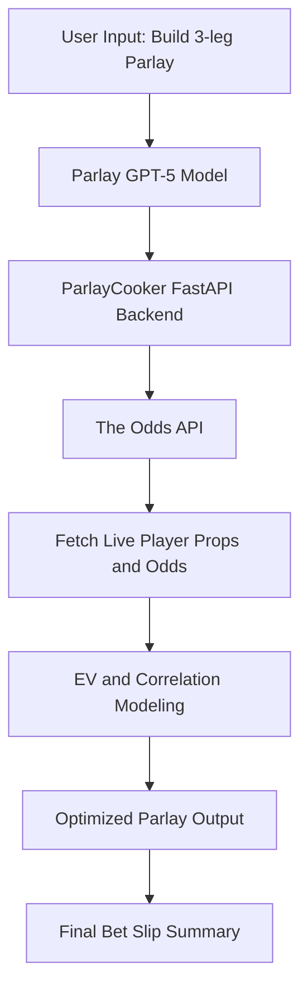

# 🏈 ParlayCooker


**ParlayCooker** is a FastAPI-based backend and GPT-integrated service that fetches live NFL player props and event odds from **The Odds API**, formats them for analysis, and serves them to the connected **Parlay GPT** model for automatic parlay construction.

---

## 🚀 Features

* **Live NFL odds and props** from DraftKings via The Odds API  
* **FastAPI endpoints** for `/health`, `/nfl/events`, and `/nfl/props`  
* **Structured OpenAPI schema** for GPT Actions integration  
* **Render deployment ready** (auto-build and start using `uvicorn`)  
* **Supports GPT-5 Actions** for real-time parlay construction  
* **Efficient filtering** for 3–4 leg parlays (passing, rushing, receiving, and anytime TDs)  

---

## 🎥 Project Overview

ParlayCooker automates the construction of high-EV NFL player prop parlays.  
It combines **real-time data** from DraftKings with **GPT-5 probabilistic modeling** to find the best-value parlays.


🧠 The GPT layer analyzes live props, computes expected value per leg, adjusts for correlation, and outputs a clean **Bet Slip Summary** ready for wagering.

---

## 🧩 Project Structure

```
parlay-cooker/
├── main.py              # FastAPI app
├── requirements.txt     # Dependencies
├── .env                 # API keys and environment vars
├── openapi.yaml         # GPT Action schema
└── README.md            # This file
```

---

## 🧮 Methodology

| Step | Process | Formula / Model |
|------|----------|----------------|
| 1 | Fetch props and odds | `/nfl/events`, `/nfl/props` endpoints |
| 2 | Estimate true probabilities | From player projections + variance |
| 3 | Compute market-implied probs | (100 / (O + 100)) or (O / (O + 100)) |
| 4 | Calculate edge | Edge = p_true − p_imp |
| 5 | Combine legs | Correlation-adjusted Gaussian approximation |
| 6 | Evaluate EV | EV = (p_joint × payout) − (1 − p_joint) × 100 |

---

## 🏗️ Architecture



---

## 💡 Example Output

```
Baker Mayfield – Over 1.5 Passing TDs (+120)
Mike Evans – Over 68.5 Receiving Yards (−110)
Rhamondre Stevenson – Over 55.5 Rushing Yards (−115)
Total Odds: +550
EV per $100: +$18
Joint Hit Probability: 0.20
Correlation Risk: Low
```

🧾 **Bet responsibly; never wager more than you can afford to lose.**

---

## ⚙️ Setup

### 1. Clone the repository

```bash
git clone https://github.com/<your-username>/parlay-cooker.git
cd parlay-cooker
```

### 2. Create a `.env` file

```bash
ODDS_API_KEY=your_theoddsapi_key_here
BASE_URL=https://api.the-odds-api.com/v4
```

### 3. Install dependencies

```bash
pip install -r requirements.txt
```

### 4. Run locally

```bash
uvicorn main:app --reload
```

Visit [http://localhost:8000](http://localhost:8000)

---

## 🌐 Deployment on Render

1. Create a **new Web Service** on [Render](https://render.com/)  
2. Connect your GitHub repo  
3. Set:
   * **Build Command:** `pip install -r requirements.txt`  
   * **Start Command:** `uvicorn main:app --host 0.0.0.0 --port $PORT`  
4. Add:
   ```
   ODDS_API_KEY=your_theoddsapi_key_here
   ```
5. Deploy → `https://parlay-cooker.onrender.com`

---

## 📡 API Endpoints

### `/health`
**GET** → Basic uptime check.

```json
{
  "ok": true,
  "provider": "TheOddsAPI",
  "time": "2025-11-08T15:00:00Z"
}
```

### `/nfl/events`
**GET** → Returns live and upcoming NFL event IDs and matchups.

```json
{
  "count": 16,
  "events": [
    { "id": "3c10bc18680995136017c3bfd3152334", "matchup": "Bills @ Dolphins" },
    { "id": "39e7c1f6e36d5bc4d2613ebf7bb83c10", "matchup": "Patriots @ Buccaneers" }
  ]
}
```

### `/nfl/props`
**GET** → Fetch player props from DraftKings for one event.

```json
{
  "provider": "TheOddsAPI",
  "count": 42,
  "props": [
    {
      "player": "Josh Allen",
      "market": "player_pass_tds",
      "line": 1.5,
      "direction": "Over",
      "odds": -187,
      "book": "draftkings",
      "game": "Bills @ Dolphins"
    }
  ]
}
```

---

## 🤖 GPT Specification Summary

- **Model:** GPT-5 (custom logic)  
- **Purpose:** Construct NFL player prop parlays maximizing expected value  
- **Constraints:**  
  - Max 4 legs  
  - Min 3% per-leg edge  
  - Reject lines worse than −180 unless EV > 0  
  - Weather and injury adjustments applied  
- **Outputs:**  
  - 3–4 leg parlays  
  - Confidence %, rationale, and EV  
  - Clean “Bet Slip Summary”  

---

## 🧠 GPT Integration

The service is integrated with **OpenAI Actions** via `openapi.yaml`. GPT uses this flow:

1. Call `listNflEvents` → Get active games  
2. Call `getNflProps` → Fetch DraftKings props  
3. Apply probabilistic modeling → Build optimized 3–4 leg parlays  

---

## 🧱 Contributing / Extending

Contributions and ideas are welcome!

Possible extensions:
- 🏀 Add NBA or MLB props  
- 💰 Integrate FanDuel / BetMGM APIs  
- 📊 Streamlit dashboard for visualization  
- 📈 Add bankroll / Kelly staking models  

**To contribute:**
1. Fork the repo  
2. Create a feature branch  
3. Submit a pull request  

---

## 📦 requirements.txt

```
fastapi==0.115.5
uvicorn==0.32.0
httpx==0.27.2
python-dotenv==1.0.1
requests==2.32.3
```

---

## 📄 License

**MIT License © 2025 ParlayCooker Project**  
Use responsibly. This project is for **informational and entertainment purposes only** — not financial advice.

---

### 🙏 Acknowledgements

Developed by **Methru Bandara**  
Integrated with **The Odds API** and **OpenAI GPT-5** for automated NFL parlay generation.

---

> 🧾 *Bet responsibly; never wager more than you can afford to lose.*
